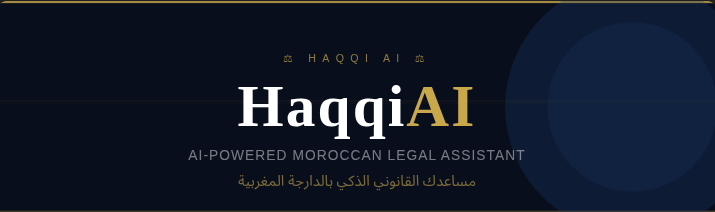

# حقي AI — Haqqi AI

> مساعدك القانوني الذكي بالدارجة المغربية  
> Your AI-powered Moroccan legal assistant in Darija



---

## 🇲🇦 About the Project

**Haqqi AI** is a free, mobile-first Moroccan legal assistant that helps citizens, law students, and legal experts navigate Moroccan law — all in Darija.

Built for the **ENSMR Hackathon 2026**, Haqqi AI bridges the gap between ordinary Moroccans and the legal system by making legal information accessible, understandable, and actionable.

### Target Users

| Level | User                         | Experience                                          |
| ----- | ---------------------------- | --------------------------------------------------- |
| L1    | مواطن عادي — Citizen         | Simple Darija Q&A, common legal scenarios           |
| L2    | طالب قانون — Law Student     | Law library, legislative references, research tools |
| L3    | محامي / خبير — Lawyer/Expert | Case management, AI drafting, document analysis     |

---

## ✨ Features

- 🗣️ **Darija-first** — Ask legal questions in Moroccan Arabic
- ⚖️ **Moroccan Law RAG** — Answers grounded in official Moroccan legislation
- 👤 **3-level dashboard** — Personalized experience per user type
- 📁 **Case management** — Full case workspace for lawyers (L3)
- 📚 **Law library** — Browse moudawwana, labor code, criminal law
- 🔐 **Google OAuth** — Secure login with Supabase Auth
- 📄 **Document generation** — AI-drafted contracts and legal memos
- 🔒 **Privacy-first** — Row Level Security on all user data

---

## 🛠️ Tech Stack

### Frontend

- React 18 + TypeScript + Vite
- Tailwind CSS (RTL-first)
- Lucide React icons
- React Router v6
- Supabase JS client

### Backend

- Django + Django REST Framework (Python)
- REST API endpoints consumed by the frontend

### AI / RAG Pipeline

- LangChain + Gemini (language model)
- Pinecone (vector store for Moroccan law embeddings)
- RAG pipeline for grounded legal answers
- Supabase (PostgreSQL + Auth + Storage)

### Infrastructure

- Supabase (database, auth, storage)
- Google OAuth 2.0
- Vercel (frontend deployment)

---

## 🚀 Getting Started

### Prerequisites

- Node.js 18+
- Python 3.10+
- Supabase account
- Google Cloud Console project

### Frontend Setup

```bash
# Clone the repo
git clone https://github.com/AdilAmejoud/Haqqi_AI.git
cd Haqqi_AI/frontend

# Install dependencies
npm install

# Set up environment variables
cp .env.example .env.local
# Fill in your Supabase URL and anon key

# Start dev server
npm run dev
```

### Backend Setup

```bash
cd Haqqi_AI/backend

# Create virtual environment
python -m venv venv
source venv/bin/activate  # Windows: venv\Scripts\activate

# Install dependencies
pip install -r requirements.txt

# Set up environment variables
cp .env.example .env
# Fill in your API keys

# Run migrations
python manage.py migrate

# Start server
python manage.py runserver
```

### Environment Variables

```text
**frontend/.env.local**
VITE_SUPABASE_URL=https://your-project.supabase.co
VITE_SUPABASE_ANON_KEY=your-anon-key-here
VITE_APP_URL=http://localhost:3002

**backend/.env**
SUPABASE_URL=https://your-project.supabase.co
SUPABASE_SERVICE_ROLE_KEY=your-service-role-key
GEMINI_API_KEY=your-gemini-key
PINECONE_API_KEY=your-pinecone-key
PINECONE_INDEX=haqqi-legal
```

---

## 🗄️ Database Schema

```sql
profiles          -- user profiles with legal_level
conversations     -- chat sessions
messages          -- individual messages with legal sources
documents         -- AI-generated contracts and memos
cases             -- lawyer case management (L3)
case_documents    -- junction table linking cases to documents
```

All tables use **Row Level Security (RLS)** — users can only access their own data.

```text

## 📁 Project Structure

Haqqi_AI/
├── frontend/ # React + Vite app
│ ├── src/
│ │ ├── components/ # Reusable UI components
│ │ │ ├── dashboard/ # CitizenDashboard, StudentDashboard, ExpertDashboard
│ │ │ └── AppShell.tsx # Layout wrapper
│ │ ├── screens/ # Full page views
│ │ ├── utils/
│ │ │ └── supabase/ # Auth, profile, client
│ │ ├── types.ts # TypeScript types
│ │ └── App.tsx # Router and auth logic
│ └── .env.example
├── backend/ # FastAPI + RAG pipeline
├── docs/ # Architecture and API docs
└── README.md
```

---

## 🤝 Team

| Name             | Role                                      |
| ---------------- | ----------------------------------------- |
| Adil Amejoud     | Frontend Lead — React, Auth, UI/UX        |
| Mourice Louba    | Backend Lead — Django, REST API, Database |
| Marouane Amguine | AI Lead — LangChain, Gemini, Pinecone RAG |

---

## 🏆 Hackathon

Built for **ENSMR Hackathon 2026** — Track: Legal Tech / AI for Social Good

**Problem**: 70% of Moroccans cannot afford legal consultation  
**Solution**: Free AI legal assistant in Darija, available 24/7

---

## 📄 License

This project is built for educational and hackathon purposes.  
© 2026 Haqqi AI Team — All rights reserved.

---

> منصة حقي AI مخصصة للمعلومات القانونية فقط — ليست بديلاً عن محامٍ مختص
